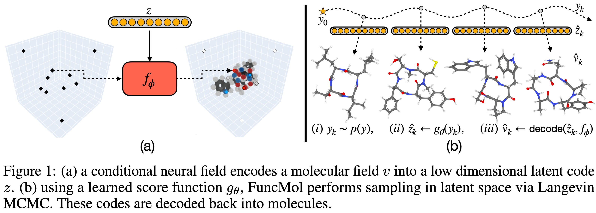

# FuncMol: Score-based 3D molecule generation with neural fields
This repository contains implementation of [FuncMol](https://openreview.net/forum?id=9lGJrkqJUw), a model for unconditional 3D molecule generation using neural fields:

```
@inproceedings{kirchmeyer2024funcmol,
  title={Score-based 3D molecule generation with neural fields},
  author={Kirchmeyer, Matthieu and Pinheiro, Pedro O and Saremi, Saeed},
  booktitle={NeurIPS},
  year={2024}
}
```



## Workflow
We assume the user have anaconda (or, preferably mamba) installed.
Multi GPU support is managed with Pytorch Lightning Fabric.
Configs are managed with Hydra and logging is managed by WandB.

### 1. Install the environment
Install the funcmol env and package:
```bash
mamba env create -f env.yml
conda activate funcmol
pip install -e .
```

### 2. Prepare data
To preprocess the QM9 data, run:
```bash
cd funcmol/dataset; python create_data_qm9.py
```

And to preprocess the GEOM-drugs data, run:
```bash
cd funcmol/dataset; python create_data_geom_drugs.py
```

These two scripts will preprocess the QM9 and the GEOM-drugs dataset (it will take dozens of minutes to process the GEOM-drugs dataset). We use the split on the official [MiDi's implementation](https://github.com/cvignac/MiDi).

To preprocess CREMP data, first download `pickle.tar.gz` (and untar it) and `summary.csv` from [this link](https://zenodo.org/records/7931445) and place them in `dataset/data/cremp/`. Then, run the following command to generate the dataset with 50 conformers per molecule:
```bash
cd funcmol/dataset; python create_data_cremp.py
```

### 3. Train the neural field (NF)
FuncMol is a generative model in latent space. We release the code for the setting where the latent space is constructed with an auto-encoder. The decoder is a conditional neural field and the encoder is a 3D CNN. To train the neural field-based auto-encoder on QM9, run the following command:
```bash
python train_nf.py --config-name train_nf_qm9
```
To train on GEOM-drugs or CREMP, use the configs `train_nf_drugs`, `train_nf_cremp`, respectively.
These scripts will save the neural field weights and configs in `exps/neural_field/`. We train the neural fields with 2 A100 GPUs.

To evaluate the neural field, run:
```bash
python eval_nf.py nf_pretrained_path=$NF_PRETRAINED_PATH
```
where `$NF_PRETRAINED_PATH` is the path where the neural field `model.pt` is saved. This script will save some reconstructed samples (in .sdf file format) on the NF folder.

### 4. FuncMol training and sampling

#### 4.1. Train the denoiser
To eg train funcmol on GEOM-drugs (assuming the neural field was trained, see above), run:
```bash
python train_fm.py --config-name train_fm_drugs nf_pretrained_path=$NF_PRETRAINED_PATH dset.batch_size=1024
```

This script will save the model/configs in  `exps/funcmol/` folder. We train the denoisers with 1 A100 GPU.

We also include an option to pre-compute the codes, then train the denoiser on them. In this setting, we first infer the codes for multiple augmented versions of the dataset, save them on disk, then train the denoiser on the pre-computed codes. This approach save computation during training (by using a lot of disk space).

On this setting, you need to run `infer_codes.py` to infer the code for the whole dataset and save on disk:
```bash
python infer_codes.py split=val nf_pretrained_path=$NF_PRETRAINED_PATH split=train n_dataset_iterations=30
```
This script will generate 30 binary files, each containing the codes for all molecules of the train set with random rotations. You will need to run this for all the there splits. Then, to train the denoiser using the pre-computed codes, run:
```bash
python train_fm.py --config-name train_fm_drugs nf_pretrained_path=$NF_PRETRAINED_PATH dset.batch_size=2048 on_the_fly=False
```

#### 4.2. Sample molecules
To sample 1000 molecules with the above funcmol model, run:
```bash
python sample_fm.py --config-name sample_fm  fm_pretrained_path=$FM_PRETRAINED_PATH wjs.n_chains=200
```
where `$FM_PRETRAINED_PATH` is the path ff the pretrained funcmol model  (section 4.1).
To change the number of walk steps (e.g. on CREMP) add `wjs.steps_wjs=10000 wjs.max_steps_wjs=10000`.

## License
This code is released under the Genentech Non-Commercial Software License Version 1.0, October 2023. See LICENSE.txt for details.

The Voxel class in funcmol/dataset/field_maker.py is a modified version of https://bitbucket.org/grogdrinker/pyuul/src/master/pyuul/VolumeMaker.py and is covered separately by the LGPLv3 license. See LICENCE_LGPLv3.txt for details.